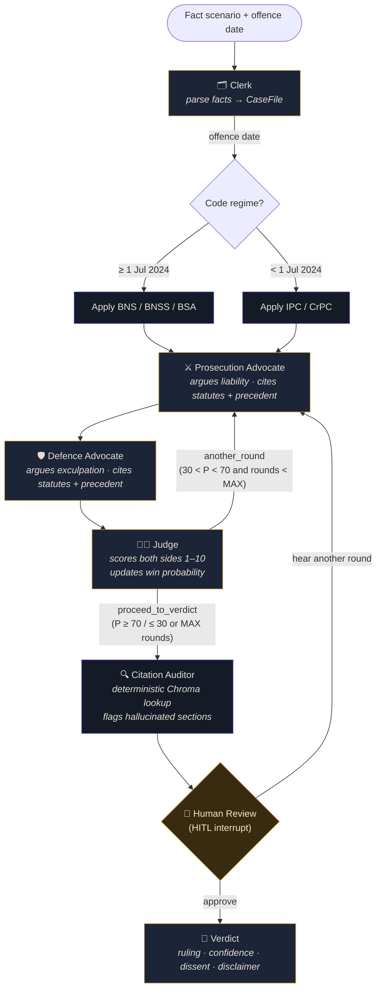
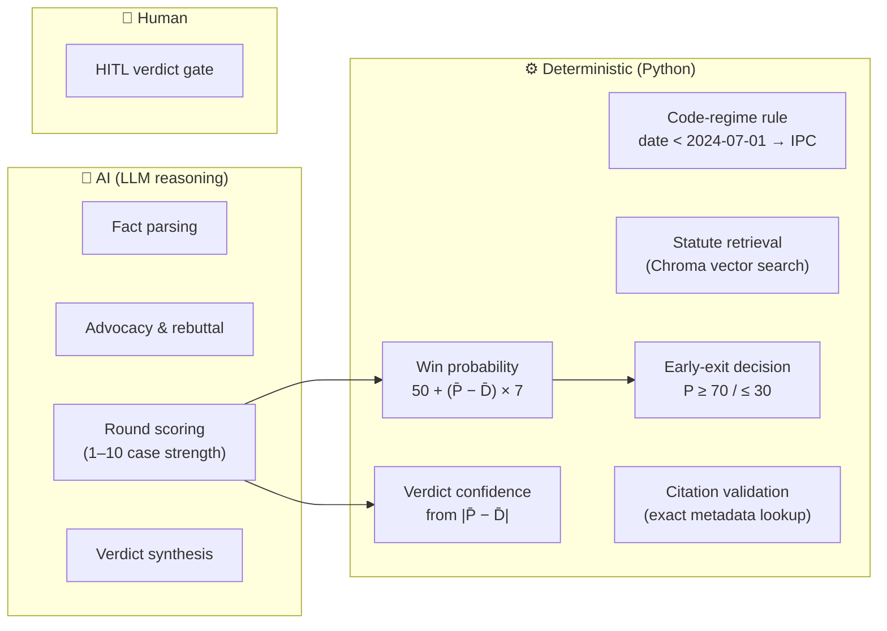
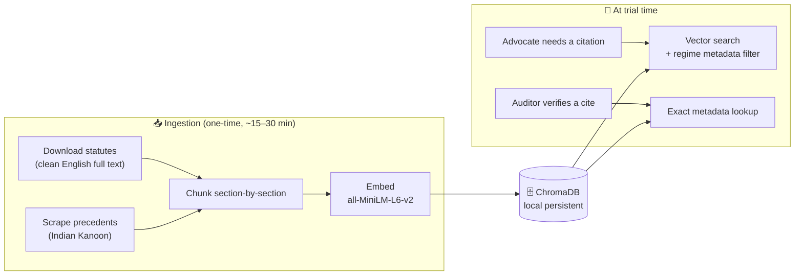

<div align="center">

# ⚖️ Nyāya

### Multi-Agent Adversarial Legal Reasoning for Indian Law

*Two AI advocates debate. An AI judge scores every round. A deterministic auditor blocks hallucinated citations. A human approves the verdict.*


</div>

> **Nyāya** (न्याय) is the Sanskrit word for *justice*.
>
> **Disclaimer:** This system is an AI-powered **educational simulation**. It does **not** constitute legal advice. All outputs are for academic and research purposes only.

---

## The Problem

**Who it's for:** Law students, moot-court competitors, legal-aid paralegals, and citizens who want to understand how a case might be reasoned in an Indian court.

**The pain point:** Single-prompt LLMs give one-sided, ungrounded answers and routinely **hallucinate Indian statute numbers** — dangerous in a legal context. No accessible tool today will (a) argue *both* sides rigorously, (b) ground every claim in real statutory text, (c) apply the correct code regime (**BNS vs IPC**, decided by the offence date), and (d) deliver a judge-adjudicated verdict with a **citation-integrity guarantee**.

**The solution — Nyāya:** A multi-agent moot court. Two opposing advocate agents debate across up to three rounds, each retrieving *real* statute sections from a local RAG corpus. An independent **Judge** scores each round (1–10 per side), maintains a deterministic running **win probability**, and controls the loop — proceeding to verdict early when the case becomes decisively one-sided. A **Citation Auditor** deterministically validates every cited section against the corpus and surfaces any hallucinated citations to a **human reviewer**, who must approve before the verdict is finalised — and may send the advocates back for further rounds.

---

## How It Works — System Architecture

Nyāya is a **LangGraph** state machine. Each node is an agent (or a deterministic step); edges are conditional and drive the loop.



### The three conditional branches (the decision points)

| Branch | Trigger | Options |
|--------|---------|---------|
| **Code regime** | Clerk extracts the offence date | BNS (≥ Jul 2024) or IPC (< Jul 2024) — a pure Python rule |
| **Judge routing** | After each round | `another_round` (loop) **or** `proceed_to_verdict` — forced to proceed when win probability reaches **≥ 70 / ≤ 30**, or at the `MAX_ROUNDS` cap (default 3) |
| **Auditor → HITL** | After the citation audit | Always routes to the human gate, attaching the audit result (verified + hallucinated citations) for the reviewer to act on |

---

## The Agents

| Agent | Role | Tools | Output |
|-------|------|-------|--------|
| 🗂️ **Clerk** | Parses facts → structured `CaseFile`; sets the code regime deterministically | none | `CaseFile` |
| ⚔️ **Prosecution Advocate** | Argues liability; must cite ≥ 2 statutes, plus a precedent when one is on point | statute retrieval, precedent retrieval (local corpus → Tavily fallback) | `Argument` |
| 🛡️ **Defence Advocate** | Argues exculpation; same citation requirements | statute retrieval, precedent retrieval (local corpus → Tavily fallback) | `Argument` |
| 👨‍⚖️ **Judge** | Scores each side's round strength (1–10) on the merits; decides loop vs proceed | none | `JudgeScore` |
| 🔍 **Auditor** | Validates every cited statute against the corpus; flags hallucinations | `citation_validator_tool` | `CitationAuditResult` |

> **Two-tier LLM design:** the Judge (round scoring + final verdict) runs a **stronger reasoning model** (`gpt-oss-120b`) than the advocates (`llama-3.3-70b-versatile`), because verdict quality is won or lost there. Each model draws on a *separate* Groq free-tier token budget and falls back independently under rate limits.

---

## Where AI Ends and Determinism Begins

A core design principle: **the LLM supplies judgement; Python supplies the numbers.** Every quantitative signal is reproducible.



| Step | Type | Why |
|------|------|-----|
| Fact parsing (Clerk) | **AI** | Natural-language understanding to extract legal questions |
| Code-regime selection | **Deterministic** | `offence_date < 2024-07-01 → IPC` — a pure Python rule |
| Statute retrieval | **Deterministic** | Chroma vector search with a metadata filter |
| Advocacy | **AI** | Legal reasoning, argument construction, rebuttal |
| Round scoring (Judge) | **AI** | Scores each side's **case strength on the merits** — not rhetorical polish |
| Win probability | **Deterministic** | `50 + (mean pros_strength − mean def_strength) × 7`, clamped to `[5, 95]` |
| Early-exit decision | **Deterministic** | Proceeds once win probability reaches ≥ 70 / ≤ 30, or at `MAX_ROUNDS` |
| Citation validation (Auditor) | **Deterministic** | Exact metadata lookup in Chroma — no LLM involved |
| Verdict rendering | **AI** | Synthesis of all rounds into a reasoned conclusion |
| Verdict confidence | **Deterministic** | Derived from the average per-round strength margin `abs(P̄ − D̄)` |
| HITL gate | **Human** | High-stakes output; mandatory review before finalisation |

---

## Scoring, Win Probability & Confidence

The trial's quantitative signals are **deliberately deterministic** — the LLM Judge supplies only the qualitative input (each side's 1–10 *case-strength* score per round, where dispositive points like inadmissible evidence or a complete defence dominate). Every number derived from it is computed in Python, so the trajectory is reproducible and explainable. The three signals are mutually consistent because they all flow from the same merit-based strength scores.

- **Win probability** is the running **balance** of the case, not a cumulative tally:
  `win_probability = 50 + (mean pros_strength − mean def_strength) × 7`, clamped to `[5, 95]`.
  Using the *average* margin (rather than summing every round) means a steady modest edge reads as a lean (~60–65%) instead of ballooning to 95% over many rounds — so the headline figure matches the confidence and the verdict's own tone.
- **Early exit:** once win probability reaches **≥ 70 or ≤ 30** (an average margin of ~2.9+, a clear ~3-point lead), the case is decisively one-sided and the Judge proceeds straight to verdict. `MAX_ROUNDS` (default 3) caps the *automatic* loop; at the human gate the reviewer can still request further rounds beyond it.
- **Verdict confidence** reflects *how decisive* the win was, scaled from the same **average per-round strength margin** (`abs(P̄ − D̄)`): ~1-point margin → low, 2 → moderate, 3 → high, 4+ → overwhelming.
- **Ruling consistency:** the final verdict is given the running win probability and instructed to rule in the direction it indicates (departures must be justified in the dissent), so the ruling, the probability, and the confidence never contradict one another.

---

## The RAG Pipeline

Every citation an advocate makes is grounded in real statutory text retrieved from a local, Docker-free vector store.



See **[docs/RAG.md](docs/RAG.md)** for the full ingestion pipeline, chunking strategy, metadata schema, and retrieval behaviour.

---

## Quickstart

### 1. Install

```bash
pip install -r requirements.txt
```

### 2. Configure

```bash
cp .env.example .env
# Fill in GROQ_API_KEY (free) and TAVILY_API_KEY in .env
```

### 3. Build the legal corpus (RAG)

```bash
python -m ingestion.build_corpus
```

This downloads statute texts, scrapes landmark precedents, chunks them section-by-section, and embeds them into ChromaDB. **Expect ~15–30 min on first run.** Verify afterwards with `python -m tools.inspect_corpus`.

### 4. Launch the courtroom 🏛️

**Web app (recommended)** — a live, streaming courtroom UI:

```bash
streamlit run app.py
```

Pick a sample case (or paste your own facts), set the offence date, and hit **Convene Court**. Arguments stream in round by round, the scoreboard updates live, and the trial pauses at the **verdict gate** for you to deliver the verdict or hear another round.

**Command line** — for scripting and demos:

```bash
# Interactive (with HITL prompt)
python -m cli.run_case "On 15 August 2024, accused Ravi was caught stealing..."

# From a file
python -m cli.run_case --file path/to/case.txt

# Auto-approve HITL (for demo/eval)
python -m cli.run_case --auto "Fact scenario here..."
```

### 5. Run the evaluation suite

```bash
python -m eval.evaluate
```

---

## Tech Stack

| Component | Technology |
|-----------|-----------|
| Agent framework | **LangGraph** (`StateGraph` + `interrupt`) |
| Advocate LLM | Groq — `llama-3.3-70b-versatile` (free tier) |
| Judge LLM | Groq — `openai/gpt-oss-120b` (stronger reasoning, separate token budget) |
| Vector database | **ChromaDB** (local persistent, no Docker) |
| Embeddings | `sentence-transformers/all-MiniLM-L6-v2` (free, local) |
| Precedent search | Tavily API (internet fallback) |
| Web UI | **Streamlit** |
| Observability | LangSmith tracing |
| PDF parsing | PyMuPDF |
| Precedent scraping | BeautifulSoup4 + Indian Kanoon |

> Groq is the default (free), but the LLM backend is pluggable — Anthropic Claude and Google Gemini are configurable via `.env` (`MOOT_COURT_LLM`).

---

## Corpus Contents

### Statutes (RAG)

| Act | Regime | Year |
|-----|--------|------|
| Bharatiya Nyaya Sanhita (BNS) | BNS | 2023 |
| Bharatiya Nagarik Suraksha Sanhita (BNSS) | BNS | 2023 |
| Bharatiya Sakshya Adhiniyam (BSA) | BNS | 2023 |
| Indian Penal Code (IPC) | IPC | 1860 |
| Code of Criminal Procedure (CrPC) | IPC | 1973 |
| Constitution of India (Part III + IV) | CONST | 1950 |

### Precedents (scraped from Indian Kanoon)

**23 landmark Supreme Court judgments** across fundamental rights, murder / culpable homicide, theft / property, evidence, private defence, bail / procedure, sentencing, sexual offences, 498A, and custodial rights. Each doc ID is verified against the live site and re-validated by party name at scrape time, so the saved file always matches the case it claims. The list is biased toward the most-cited judgments in each area (Arnesh Kumar, Satender Antil, D.K. Basu, Sharad Sarda, …).

---

## Evaluation Results

| # | Case | Code Regime | Expected Ruling | Audit | Status |
|---|------|-------------|-----------------|-------|--------|
| 1 | Clear liability (CCTV theft) | BNS ✓ | liable | Pass | ✅ |
| 2 | Clear acquittal (verified alibi) | BNS ✓ | not_liable | Pass | ✅ |
| 3 | Borderline (circumstantial) | BNS ✓ | inconclusive | Pass | ✅ |
| 4 | Citation trap (hallucination test) | BNS ✓ | blocked by Auditor | Pass | ✅ |
| 5 | Pre-July 2024 offence | **IPC** ✓ | any | Pass | ✅ |

---

## Guardrails

- **Mandatory disclaimer** on every `Verdict` object — cannot be suppressed.
- **HITL gate** — LangGraph `interrupt()` suspends the graph; a human must approve before the verdict is finalised.
- **Citation validator** — deterministic Chroma metadata lookup, *not* an LLM, so it cannot hallucinate; every cited section is checked against the corpus and any hallucinations are flagged to the reviewer at the gate.
- **Max-rounds cap** — `MOOT_COURT_MAX_ROUNDS` (default 3) caps the automatic loop; the reviewer may still request more rounds at the gate.
- **Refusal** — the Clerk's system prompt rejects personal legal-advice requests framed as "my case".

---

## Limitations & Future Work

- The RAG corpus covers the main statutes but not all subordinate legislation (rules, regulations).
- Precedent retrieval is local-first (the embedded landmark-case corpus) with Tavily internet search as a fallback when the corpus has no relevant match or no API key is configured.
- The LLM may still reason incorrectly even when citing real sections — the Auditor checks *existence*, not interpretation accuracy.
- Future: a sub-agent for sentencing guidelines and quantum of punishment.

---

## Project Structure

```
Nyaya/
├── app.py            # Streamlit web app (streaming courtroom UI)
├── agents/           # 5 agent nodes + system prompts
├── cli/              # CLI entry point
├── corpus/           # Downloaded statutes + scraped precedents
├── eval/             # 5 evaluation cases + evaluator
├── graph/            # LangGraph state, edges, graph assembly
├── ingestion/        # Download, scrape, chunk, embed pipeline
├── rag/              # Retriever + precedent search
├── tools/            # LangChain tools (statute, precedent, citation validator)
├── utils/            # LLM factory
└── docs/             # RAG.md deep-dive
```

---

## Contributors

See **[CONTRIBUTIONS.md](CONTRIBUTIONS.md)** for the authoritative, file-level ownership matrix. Summary:

| Contributor | Primary areas |
|-------------|---------------|
| **Suraj Guduru** | Data models & graph assembly (`graph/state.py`, `graph/court.py`), Judge agent & verdict (`agents/judge.py`), LLM factory (`utils/llm.py`), `rag/retriever.py`, HITL/verdict UI, eval runner |
| **Sai Venkatesh Alampally** | RAG ingestion pipeline (`ingestion/*`), statute corpus, Prosecution & Auditor agents, citation/statute tools, scoreboard UI |
| **Thrishal Madasu** | Edge routing (`graph/edges.py`), all system prompts (`agents/prompts.py`), Clerk & Defence agents, precedent search & corpus, CLI, case-display UI, README |

---

<div align="center">
<sub>⚖️ <b>Nyāya</b> — an educational simulation of Indian legal reasoning. Not legal advice.</sub>
</div>
